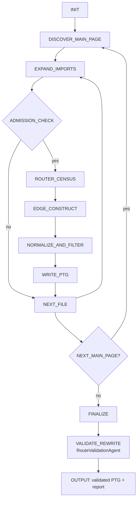

# 基于大模型生成PTG的HarmonyOS应用自动化测试

## 数据集（被测应用）
- HarmoneyOpenEye: https://github.com/WinWang/HarmoneyOpenEye
- Harmony-arkts-movie-music-app-ui: https://github.com/wuyuanwuhui99/Harmony-arkts-movie-music-app-ui
- biandan-satge: https://github.com/AlthenWaySatan/biandan-satge
- open-neteasy: https://github.com/linwu-hi/open_neteasy_cloud
- Msea-HarmonyOS: https://github.com/eternaljust/Msea_HarmonyOS
- ArkTS-wphui1.0: https://gitee.com/boring-music/ArkTS-wphui1.0
- homework-taskist: https://gitee.com/handwer/homework-tasklist-v2
- on-bill: https://gitee.com/ericple/oh-bill
- MultiShopping: https://gitee.com/harmonyos/codelabs/tree/master/MultiShopping
- MultiDeviceMusic: https://gitee.com/harmonyos/codelabs/tree/master/MultiDeviceMusic

克隆数据集，例如：
```bash
python clone_projects.py E:/HarmonyOS
```

## baseline
基于模型的HarmonyOS应用自动化测试的复现结果（与原作者的论文的结果有些出入，一些指标与原作者的论文有差异）：https://github.com/sqlab-sustech/HarmonyOS-App-Test

通过静态解析生成的PTG详见/static_analysis

## 环境与配置
- Python 3.10.4
- 安装依赖
```bash
pip install -r requirements.txt
```
- LLM API key
创建.env文件，添加如以下内容：
```bash
OPENAI_API_KEY=sk-xxxx
```
- 在config.py中填写对应的大模型配置，例如：
```python
LLM_CONFIG = {  
  "deepseek": {
    "baseURL": 'https://api.deepseek.com',
    "apiKeyEnv": 'DEEPSEEK_API_KEY', # 需要自己在根目录添加.env文件存放API KEY
    "model": 'deepseek-chat', # 最终交互的模型
    "preprocessModel": 'deepseek-chat', # 预处理项目代码的模型
  }
}
```
- 在config.py中填写对应的被测应用配置，例如：
```python
APP_CONFIG = {
  "HarmoneyOpenEye": {
    "projectName": "HarmoneyOpenEye",  # 项目名称
    "projectPath": "E:/HarmonyOS/project/HarmoneyOpenEye",  # 项目路径
    "projectMainPagePath":
      "E:/HarmonyOS/project/HarmoneyOpenEye/entry/src/main/resources/base/profile/main_pages.json",  # 项目主页面路径
    "importAliasMap": {  # 可选：导入别名映射（相对 projectPath 或绝对路径）
      "@/": "src/main/ets",
      "@entry/": "src/main/ets",
      "@common/": "../common/src/main/ets"
    },
  },
}
``` 

## 纯LLM交互

### prompt内容
prompt都由一下三部分组成：
1. 全局Prompt：包含项目的全局信息，如项目结构、组件库等。
2. 任务Prompt：包含具体的任务描述，如添加新页面、修改组件属性等。
3. 限制性Prompt：用于限制模型生成的代码范围，如只生成路由/导航相关的代码。

### 执行方式
```bash
python llm/workflow.py --deepseek --HarmoneyOpenEye
```

## RAG & Agent增强版本（重构代码，与之前的纯LLM做对比）

### 执行方式
```bash
python agent/workflow.py --deepseek --HarmoneyOpenEye
```

### RAG
1. 知识补充：HarmonyOS应用相关文档，补充AI ArkTS相关的知识，识别PTG中与路由跳转相关的逻辑。
2. 校验和修正：根据生成的PTG中的跳转关系，喂入相关的文件，进行校验（文件级索引和片段级索引）。

待实现，目前觉得不是很有必要。

### Multi-Agent（当前实现）
采用 LangChain + 工具化工作流实现 PTG 抽取与校验，当前架构是“状态机编排 + 局部自主决策”：
- `RouteStructureAgent`：召回优先，负责发现尽可能完整的候选边；
- `RouteValidationAgent`：精度收口，负责规则化清洗、去重与过滤无效边。

PTG schema:
```ts
type PTG = Record<PagePath, Array<{
  component: { type: string };
  event: string;
  target: string;
}>>
```

#### 1) 工作流总览（状态机）
每个 `main_page` 独立执行以下状态流转：
```text
INIT
-> DISCOVER_MAIN_PAGE
-> EXPAND_IMPORTS
-> ADMISSION_CHECK
-> ROUTER_CENSUS
-> EDGE_CONSTRUCT
-> NORMALIZE_AND_FILTER
-> WRITE_PTG
-> NEXT_FILE / NEXT_MAIN_PAGE
-> FINALIZE
```

说明：
- 全局状态迁移固定，保证可复现和可控成本。
- 局部语义任务（识别调用点、提取边、补漏）由 LLM 承担。
- 规则校验和最终写入保持确定性，避免幻觉在控制流层扩散。

#### 2) 局部自主决策（LLM + Tool Calling）
LLM 不是全流程自由调度，只在受限状态内决策：
- `ROUTER_CENSUS`：识别路由调用点并生成 `call_id`（覆盖率基线）。
- `EDGE_CONSTRUCT`：基于 `census_calls` 逐调用点构建边（主抽取）。
- `tool-calling`：补解析 `import/target_expr`，例如：
  - `resolve_import_path`
  - `resolve_target_expr`

不交给 LLM 的职责：
- 状态迁移控制；
- PTG 直接落盘；
- 跳过校验或绕过过滤规则；
- 超预算继续执行。

#### 3) RouteStructureAgent（主抽取，召回优先）
核心流程（已实现）：
- 读取 `main_pages.json`，初始化 `PTGMemory`。
- 从 main page 递归解析 import 可达 `.ets` 文件（source page 绑定当前 main page）。
- 文件准入门（仅作用于“是否进入 LLM”，不影响 import 递归）：
  - 跳过 `llm_skip_dirs`（默认：`http/route`）；
  - 仅当运行时代码命中可执行路由动作才进入 LLM（`pushUrl/replaceUrl/push/replace/back`）。
- 两阶段协作：
  - `_extract_router_census`：先统计调用点，形成 coverage 基线；
  - `_recover_edges_by_census_gap`：基于 `census_calls` 逐调用点构建边（主抽取，对应状态名 `EDGE_CONSTRUCT`）。
- 入库前做 target 合法性过滤，写入 memory（自动去重）。

#### 4) RouteValidationAgent（规则校验与重写，精度收口）
定位：
- 结构抽取后的最终规则闸门；
- 轻量、确定性、可解释，不依赖重型 LLM 回读。

输入：
- RouteStructure 输出的 PTG；
- `main_pages` 列表。

输出：
- `validated_ptg`
- `report`（修正与丢弃统计）

校验规则（当前实现）：
- 结构校验：过滤非 `dict` 边；
- 字段规范化：
  - `component.type` 非法值降级为 `__Common__`；
  - `event` 非 `onXxx` 统一为 `onClick`；
  - `target` 做 normalize/strip，并过滤无效值（如 `url`、表达式残留、空值）；
- 同 source 下按 `(component.type, event, target)` 去重；
- main pages 兜底补齐（无边页面保留空数组）。

报告字段（便于论文统计与回归）：
- `edges_in`、`edges_out`
- `edges_fixed_component`、`edges_fixed_event`
- `edges_dropped_schema`、`edges_dropped_invalid_target`
- `edges_deduped`
- `drop_reasons`

#### 5) 可观测性与运行结果
token 统计（当前实现）：
- 每次 LLM 交互后，从 LangChain 消息对象提取并打印 token 用量：
  - `census` / `construct` / `tool_calling`
- PTG 保存后打印全流程 token 汇总：
  - `calls` / `prompt` / `completion` / `total`

运行命令：
```bash
./.venv/bin/python agent/workflow.py --deepseek --HarmoneyOpenEye
```

控制台可观察到：
- RouteStructure 阶段的递归读取、两阶段抽取、tool-calling 与 token 日志；
- RouteValidation 阶段的 `report`（修正/丢弃/去重明细）；
- 最终 PTG JSON 输出。

#### 6) 状态 -> 代码函数映射（实现对齐）
下面给出论文方法中的状态，与当前代码函数的对应关系，便于复现与引用。

| 状态 | 主要职责 | 当前实现函数（RouteStructureAgent / RouteValidationAgent） |
| --- | --- | --- |
| `INIT` | 初始化模型、工具、memory、配置 | `RouteStructureAgent.__init__` |
| `DISCOVER_MAIN_PAGE` | 读取 main pages，逐个入口页面启动流程 | `RouteStructureAgent.run` |
| `EXPAND_IMPORTS` | 读取文件、提取 import、解析依赖文件 | `RouteStructureAgent._analyze_file`（内部调用 `import_resolver.extract_imports` / `resolve_imports_to_files` / `find_nested_component_files`） |
| `ADMISSION_CHECK` | 判断文件是否进入 LLM 分析 | `RouteStructureAgent._is_llm_admissible_file`、`_to_runtime_code_for_admission`、`_has_router_hints` |
| `ROUTER_CENSUS` | 统计 router 调用点（coverage 基线） | `RouteStructureAgent._extract_router_census` |
| `EDGE_CONSTRUCT` | 基于 census 调用点逐点构建路由边 | `RouteStructureAgent._recover_edges_by_census_gap`（LLM 构边 + 过滤 + merge） |
| `NORMALIZE_AND_FILTER` | 入库前 target 合法性过滤、边字段规整 | `RouteStructureAgent._analyze_file`（入库前过滤） |
| `WRITE_PTG` | 写入 PTG memory 并去重 | `PTGMemory.add_edge`（在 `_analyze_file` 中调用） |
| `FINALIZE` | 保存 PTG、输出统计日志 | `RouteStructureAgent.run`（`memory.save_json` + token summary） |
| `VALIDATE_REWRITE` | 最终规则校验与重写 | `RouteValidationAgent.validate_and_rewrite` |

补充说明：
- tool-calling 补解析能力由 `agent/tools/route_tool_calling.py` 中 `RouteToolCallingResolver.supplement_edges` 提供。
- 该能力在 `EDGE_CONSTRUCT` 状态中被调用，用于解析 `import/target_expr`。

#### 7) 状态图（Mermaid）



## 待解决/探究的问题    
1. 国内的大模型，DeepSeek目前效果还挺好的，但是其他模型效果不好，考虑不同的模型使用不同的prompt，或换模型（Qwen, Kimi）
2. SplashPage -> MainPage 是否算一条边
3. 当前仍然会在merge时出现多条边，虽然可能不影响后面自动化执行流程，但在统计时不知如何处理
4. 当前通过大模型处理，正确的边基本能够覆盖，但仍然会产生较多不存在的边，虽然这里不影响后续测试的自动流程，但看起来还是比较奇怪，主要出现在复杂一些的项目：Biandan、HarmonyMovieMusic、Homework-tasklist、MultiShopping
5. 检测出来的边，target和event正确率很高，但是componet存在于static analysis分析出来不一样的，发现一些在复杂场景AI还是难以识别跳转规则所在的组件，待优化prompt，添加few-shot，待校对的文件:MultiDeviceMusic、HarmonyOpenEye、MultiShopping
6. 原作者通过静态解析统计的结果可能存在偏差的项目：Biandan、MultiDeviceMusic、Msea-HarmonyOS
7. Msea-HarmonyOS 属于是prompt规则的问题，然后多统计了2条边（有2条重复）

## 原论文可能存在的问题
1. Harmony-arts-movie-music-app-ui项目，静态解析pages/IndexPage.ets文件的结果，代码中没有显示的路由跳转规则，但通过静态解析仍然能解析出，同时其他页面的一些跳转关系，通过静态解析无法解析出来（例如：pages/RegisterPage.ets等），但原作者仍然将其FNR率统计和计算为0%。

## 难点
1. 对于嵌套组件，如何准确识别跳转的目标，例如，pages/MainPage.ets中的代码，明面上没有与路由跳转有关的代码，但是其中嵌套着一些组件，例如pages/HomePage.ets，这个组件中则包含跳转到pages/DetailPage.ets的逻辑，则期望输出的跳转关系是pages/MainPage.ets -> pages/DetailPage.ets。这里可能涉及到上下文管理的问题，如果在每次交互中，只维护PTG，不维护项目代码的上下文，遇到一些import之类的语句（引入组件），大模型会忘记子组件与当前页面的关系；如果将整个项目上下文喂给大模型，则会出现上下文过长，产生幻觉的问题。目前的想法：全程维护PTG，同时让大模型只记住与一个主页面关联的代码上下文，当大模型开始探索下个主页面的代码时，则忘记上一个的上下文（主页面之间不会相互嵌套，不会出现一个主页面的代码中import另一个主页面，只是保留着路由跳转的关系，例如：一个主页面，跳转到另一个主页面）。
2. 如果从头到尾分析整个项目，会白白浪费很多token，如果设置一些黑名单，不让大模型分析，则需要反复手动配置，也可能会漏掉一些文件 -> 在分析之前，提前采用正则匹配检索是否存在router的内容，如果有再调用大模型分析，没有就跳过。
3. 大模型在分析长代码文件时，会难以提取上下文 -> 拆分代码，按语法边界切块，并采用重叠窗口
4. 大模型在分析和提取时必定会存在不稳定的现象（回检？待解决）

## 统计指标
参考基于模型的HarmonyOS应用自动化测试论文，包含衡量基于静态解析的PTG质量基本的指标：TP、FP、FN、Prec.。对于衡量由大模型生成PTG的质量，添加这几个指标：
1. 主指标：HER（Hallucinated Edge Rate）
定义：HER = FP / |P|
其中：
- P：Agent 生成的边集合
- G：人工标注/可信基准边集合
- FP = P - G（预测有、真实无）
解释：生成的边里有多少是“幻觉边”，越低越好。
2. 辅助指标 1：AHE（Avg Hallucinated Edges per App）
定义：AHE = FP_total / App_count
解释：每个应用平均多出多少条假边，反映绝对噪声负担。
3. Token Usage
用于反映使用大模型给每个应用生成PTG所消耗的Token，包括：输入+输出+tool_calling
