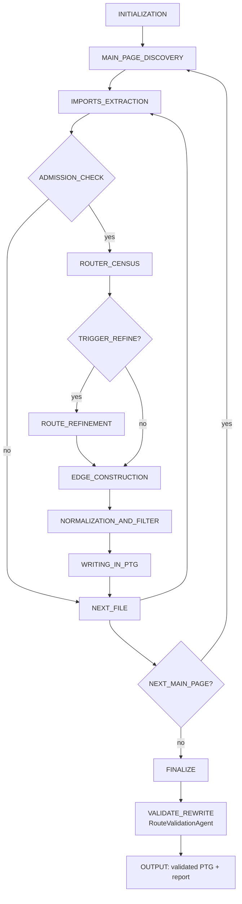

[中文](README.md) | [English](README_EN.md)

# Automated Testing for HarmonyOS Apps via LLM-Driven Workflow-Based PTG Generation

## Datasets (Target Apps)
- HarmoneyOpenEye: https://github.com/WinWang/HarmoneyOpenEye
- Harmony-arkts-movie-music-app-ui: https://github.com/wuyuanwuhui99/Harmony-arkts-movie-music-app-ui
- biandan-satge: https://github.com/AlthenWaySatan/biandan-satge
- open-neteasy: https://github.com/linwu-hi/open_neteasy_cloud
- Msea-HarmonyOS: https://github.com/eternaljust/Msea_HarmonyOS
- ArkTS-wphui1.0: https://gitee.com/boring-music/ArkTS-wphui1.0
- homework-taskist: https://gitee.com/handwer/homework-tasklist-v2
- on-bill: https://gitee.com/ericple/oh-bill
- MultiShopping: https://gitee.com/harmonyos/codelabs/tree/master/MultiShopping
- MultiDeviceMusic: https://gitee.com/harmonyos/codelabs/tree/master/MultiDeviceMusic

To clone the datasets, for example:
```bash
python clone_projects.py E:/HarmonyOS
```

## Baseline
Reproduced results for model-based automated testing of HarmonyOS apps are available here (there are some differences from the original paper, and several metrics do not exactly match the authors' reported results): https://github.com/sqlab-sustech/HarmonyOS-App-Test

The PTGs generated by static analysis are provided under `/static_analysis`. These are reproduced based on the paper above and differ slightly from the original paper's reported results.

## Environment and Configuration
- Python 3.10.4
- Install dependencies
```bash
pip install -r requirements.txt
```
- LLM API key
Create a `.env` file and add content like:
```bash
OPENAI_API_KEY=sk-xxxx
```
- Fill in the model configuration in `config.py`, for example:
```python
LLM_CONFIG = {
  "deepseek": {
    "baseURL": "https://api.deepseek.com",
    "apiKeyEnv": "DEEPSEEK_API_KEY",  # Put the API key in a .env file at the repository root
    "model": "deepseek-chat",  # Final model used for interaction
    "preprocessModel": "deepseek-chat",  # Model used for project-code preprocessing
  }
}
```
- Fill in the target-app configuration in `config.py`, for example:
```python
APP_CONFIG = {
  "HarmoneyOpenEye": {
    "projectName": "HarmoneyOpenEye",  # Project name
    "projectPath": "E:/HarmonyOS/project/HarmoneyOpenEye",  # Project path
    "projectMainPagePath":
      "E:/HarmonyOS/project/HarmoneyOpenEye/entry/src/main/resources/base/profile/main_pages.json",  # Main-page manifest path
    "importAliasMap": {  # Optional import alias map (relative to projectPath or absolute)
      "@/": "src/main/ets",
      "@entry/": "src/main/ets",
      "@common/": "../common/src/main/ets"
    },
  },
}
```

## One-Shot Pure LLM Interaction (Deprecated, kept here only for comparison)

### Prompt Contents
The prompt consists of the following three parts:
1. Global Prompt: contains project-level information such as the project structure and component library.
2. Task Prompt: contains the concrete task description, such as adding a new page or modifying component attributes.
3. Restriction Prompt: constrains the code generation scope, for example to routing/navigation-related code only.

### How to Run
```bash
python llm/workflow.py --deepseek --HarmoneyOpenEye
```

## Enhanced RAG & LLM-Based Workflow Version (Refactored code, compared with the earlier pure-LLM version)

### RAG
1. Knowledge augmentation: use HarmonyOS application documentation to supplement ArkTS-related knowledge and identify PTG logic related to route transitions.
2. Validation and correction: feed files related to the generated PTG transitions back into the system for validation (file-level indexing and snippet-level indexing).

Not implemented yet. At the moment, it does not seem very necessary.

### LLM-Based Workflow (Current Implementation)
This project uses LangChain plus a tool-augmented workflow to extract and validate PTGs. The current architecture is a "state-machine orchestration + localized autonomous decision-making" design:
- `RouteStructureAgent`: recall-first, responsible for discovering as complete a set of candidate edges as possible.
- `RouteValidationAgent`: precision-focused, responsible for normalized cleanup, deduplication, and invalid-edge filtering.

PTG schema:
```ts
type PTG = Record<PagePath, Array<{
  component: { type: string };
  event: string;
  target: string;
}>>
```

#### 1) Workflow Overview (State Machine)
Each `main_page` independently follows this state transition flow:
```text
INITIALIZATION
-> MAIN_PAGE_DISCOVERY
-> IMPORTS_EXTRACTION
-> ADMISSION_CHECK
-> ROUTER_CENSUS
-> ROUTE_REFINEMENT
-> EDGE_CONSTRUCTION
-> NORMALIZATION_AND_FILTER
-> WRITING_IN_PTG
-> NEXT_FILE / NEXT_MAIN_PAGE
-> FINALIZE
-> VALIDATE_REWRITE
```

Notes:
- Global state transitions are fixed to ensure reproducibility and controllable cost.
- Local semantic tasks such as call-site identification, edge extraction, and missing-edge recovery are handled by the LLM.
- Rule-based validation and final writing remain deterministic, preventing hallucinations from spreading through the control flow.

#### 2) Local Autonomous Decisions (LLM + Tool Calling)
The LLM does not freely schedule the entire pipeline. It only makes decisions within restricted states:
- `ROUTER_CENSUS`: identify routing call sites and generate `call_id`s as the coverage baseline.
- `ROUTE_REFINEMENT`: enrich `component/event` clues for call sites that require cross-file evidence.
- `EDGE_CONSTRUCTION`: construct edges one call at a time based on `census_calls`.
- `tool-calling`: supplement `import/target_expr` resolution, for example:
  - `resolve_import_path`
  - `resolve_target_expr`

Responsibilities not delegated to the LLM:
- state transition control;
- direct PTG persistence;
- skipping validation or bypassing filtering rules;
- continuing execution after the budget is exceeded.

#### 3) RouteStructureAgent (Main Extraction, Recall First)
Core workflow (implemented):
- Read `main_pages.json` and initialize `PTGMemory`.
- Recursively resolve import-reachable `.ets` files from each main page (`source_page` is bound to the current main page).
- File admission gate (only controls whether a file enters LLM analysis, without affecting import recursion):
  - skip `llm_skip_dirs` (default: `http/route`);
  - only enter LLM analysis when runtime code contains executable routing actions (`pushUrl/replaceUrl/push/replace/back`).
- Three-stage collaboration:
  - `_extract_router_census`: first count call sites to build the coverage baseline;
  - `_refine_cross_file_census_calls`: refine evidence and trigger clues for calls that need cross-file analysis (corresponding state: `ROUTE_REFINEMENT`);
  - `_construct_edges_from_census`: construct route edges from `census_calls` one by one (main extraction, corresponding state: `EDGE_CONSTRUCTION`).
- Before insertion, apply target-validity filtering and write to memory with automatic deduplication.

#### 4) RouteValidationAgent (Rule-Based Validation and Rewrite, Precision-Focused)
Role:
- the final rule gate after structural extraction;
- lightweight, deterministic, interpretable, and does not rely on heavyweight LLM rereading.

Input:
- PTG output from RouteStructure;
- `main_pages` list.

Output:
- `validated_ptg`
- `report` (statistics on fixes and dropped edges)

Validation rules (current implementation):
- Structural validation: filter out edges that are not `dict`s;
- Field normalization:
  - downgrade invalid `component.type` values to `__Common__`;
  - normalize non-`onXxx` events to `onClick`;
  - normalize/strip `target` and filter invalid values (such as `url`, residual expressions, and empty values);
- Deduplicate within the same source by `(component.type, event, target)`;
- Backfill all main pages so pages without edges still keep empty arrays.

Report fields (useful for paper statistics and regression tracking):
- `edges_in`, `edges_out`
- `edges_fixed_component`, `edges_fixed_event`
- `edges_dropped_schema`, `edges_dropped_invalid_target`
- `edges_deduped`
- `drop_reasons`

#### 5) Observability and Runtime Outputs
Token statistics (current implementation):
- After each LLM interaction, token usage is extracted from LangChain message objects and printed:
  - `census` / `trigger_refine` / `construct` / `tool_calling`
- After PTG persistence, the full token summary is printed:
  - `calls` / `prompt` / `completion` / `total`

Run command:
```bash
./.venv/bin/python agent/workflow.py --deepseek --HarmoneyOpenEye
```

What can be observed in the console:
- recursive reading, three-stage extraction, tool-calling, and token logs during the RouteStructure phase;
- the RouteValidation `report` (fix/drop/dedup details);
- the final PTG JSON output.

#### 6) State -> Code Function Mapping (Implementation Alignment)
Below is the mapping between the method states described in the paper and the current implementation functions for reproducibility and citation.

| State | Main Responsibility | Current Implementation Function (RouteStructureAgent / RouteValidationAgent) |
| --- | --- | --- |
| `INITIALIZATION` | Initialize model, tools, memory, and configuration | `RouteStructureAgent.__init__` |
| `MAIN_PAGE_DISCOVERY` | Read main pages and start the workflow for each entry page | `RouteStructureAgent.run` |
| `IMPORTS_EXTRACTION` | Read files, extract imports, and resolve dependency files | `RouteStructureAgent._analyze_file` (internally calls `import_resolver.extract_imports` / `resolve_imports_to_files` / `find_nested_component_files`) |
| `ADMISSION_CHECK` | Decide whether a file should enter LLM analysis | `RouteStructureAgent._is_llm_admissible_file`, `_to_runtime_code_for_admission`, `_has_router_hints` |
| `ROUTER_CENSUS` | Count router call sites as the coverage baseline | `RouteStructureAgent._extract_router_census` |
| `ROUTE_REFINEMENT` | Enrich `component/event` clues for calls that require cross-file parsing, reducing ambiguity before edge construction | `RouteStructureAgent._refine_cross_file_census_calls` |
| `EDGE_CONSTRUCTION` | Construct route edges call by call based on census results | `RouteStructureAgent._construct_edges_from_census` (LLM edge construction + filtering + merge) |
| `NORMALIZATION_AND_FILTER` | Apply target-validity filtering and edge-field normalization before insertion | `RouteStructureAgent._analyze_file` (pre-insertion filtering) |
| `WRITING_IN_PTG` | Write to PTG memory and deduplicate | `PTGMemory.add_edge` (called inside `_analyze_file`) |
| `FINALIZE` | Save PTG and output statistics logs | `RouteStructureAgent.run` (`memory.save_json` + token summary) |
| `VALIDATE_REWRITE` | Final rule-based validation and rewrite | `RouteValidationAgent.validate_and_rewrite` |

Additional notes:
- The tool-calling supplement capability is provided by `RouteToolCallingResolver.supplement_edges` in `agent/tools/route_tool_calling.py`.
- This capability is invoked in the `EDGE_CONSTRUCTION` state to resolve `import/target_expr`.

#### 7) State Diagram (Mermaid)


## Open Problems / Questions for Further Study
1. Should `SplashPage -> MainPage` count as an edge?
2. Projects whose statically parsed results may contain deviations from the original paper: `Biandan`, `MultiDeviceMusic`, `Msea-HarmonyOS`.
3. For `Msea-HarmonyOS`, the issue seems to come from prompt rules, resulting in two extra counted edges (both duplicated).
4. **The current architecture cannot be considered a closed-loop agent because it lacks a feedback mechanism. In this scenario, however, adding feedback may not lead to significant improvement while it would greatly increase token cost. For now, it is defined as an LLM-driven semi-agentic workflow.**

## Potential Issues in the Original Paper
1. In the `Harmony-arts-movie-music-app-ui` project, static analysis of `pages/IndexPage.ets` reports route transitions that are not explicitly visible in the code, while some transitions on other pages cannot be recovered by static analysis at all (for example `pages/RegisterPage.ets`). Even so, the original paper still reports the FNR for that project as 0%.

## Difficulties
1. For nested components, how can we accurately identify the navigation target? For example, `pages/MainPage.ets` may contain no obvious routing code on the surface, but it imports nested components such as `pages/HomePage.ets`, and that nested component contains logic that jumps to `pages/DetailPage.ets`. The expected output edge is therefore `pages/MainPage.ets -> pages/DetailPage.ets`. This raises a context-management problem. If each interaction only maintains the PTG but not project-code context, the model may forget the relationship between child components and the current page when it encounters `import` statements. If the entire project context is given to the model, the context may become too long and cause hallucinations. The current idea is to maintain the PTG throughout the process while only keeping the code context associated with one main page at a time. When the model starts exploring the next main page, it forgets the previous one. Main pages do not nest each other, and one main page should not import another main page; they only preserve route-transition relationships, such as one main page navigating to another main page.
2. Analyzing the whole project end to end wastes many tokens. If we use blacklists to prevent the model from analyzing some files, they must be configured repeatedly by hand and may still miss relevant files. A better approach is to run regex-based routing checks before analysis: if router-related content exists, then invoke the LLM; otherwise skip it.
3. The model may struggle to retain context when analyzing long source files. One possible solution is to split code by syntax boundaries and use overlapping windows.

## Evaluation Metrics
Following the paper on model-based automated testing for HarmonyOS apps, the basic metrics used to evaluate statically parsed PTG quality include `TP`, `FP`, `FN`, and `Prec.`. To evaluate the quality of PTGs generated by LLMs, the following additional metrics are introduced:
1. Primary metric: `HER` (Hallucinated Edge Rate)
Definition: `HER = FP / |P|`

Where:
- `P`: the edge set generated by the agent
- `G`: the manually labeled / trusted ground-truth edge set
- `FP = P - G` (predicted positive, actually absent)

Explanation: the proportion of hallucinated edges among generated edges. Lower is better.

2. Auxiliary metric 1: `AHE` (Average Hallucinated Edges per App)
Definition: `AHE = FP_total / App_count`
Explanation: the average number of false edges introduced per app, reflecting the absolute noise burden.

3. Token Usage
Used to reflect the number of tokens consumed by the LLM to generate PTGs for each app, including input, output, and tool-calling.

## Automated Testing
1. For DevEco and HarmonyOS development dependencies and for how to run automated tests, refer to: https://github.com/sqlab-sustech/HarmonyOS-App-Test
2. Copy all files under `/test` into the corresponding project, for example `/Users/edwincai/MUST/projects/HarmoneyOpenEye/entry/src/ohosTest/ets/test`. Then you can set the runtime duration, start the test execution, and filter the results by `testTag`.

## Experimental Data
1. Reproduced static-analysis baseline data are under `/static_analysis`; PTG construction results, automated-testing experiment data, and chart plotting assets are under `/data`.
2. Example experiment logs are under `/log`.
